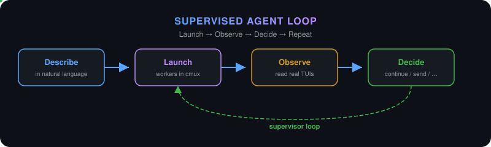

<div align="center">



# Taskforce

**One Skill for supervised multi-agent coding loops.**

Describe your workflow in natural language. Taskforce launches coding CLIs in
cmux, reads their real terminals, and keeps watching until the work is truly done.

[](LICENSE)
[](https://nodejs.org/)

[中文说明](README.zh-CN.md) · [Contributing](CONTRIBUTING.md) · [Security](SECURITY.md)

</div>

---

## Single-node example



*One node (node-opencode) across 4 ticks — coding, permission menu,
goal drift, and verified completion. Chief makes an independent decision per tick.*

Tell your coding CLI:

```text
Use Taskforce. Launch opencode to develop a Tank Battle game with a map,
enemy AI, and a scoring system. When it finishes, launch codex to inspect
the code and tests and fix the issues it finds. Keep supervising until done.
```

| Tick | What Chief observes | Chief decision |
|---|---|---|
| TICK 1 | opencode is writing Tank.ts, 3/5 tests passing | `continue` — normal progress, do not rush |
| TICK 4 | opencode hit a permission menu, requesting write to Tank.ts | `send key:enter` — approve project-scoped write |
| TICK 8 | opencode started writing Network.ts, drifting from single-player goal | `send input` — "single-player only, no network multiplayer" |
| TICK 12 | All tests passing, implementation matches goal | `complete` — verified goal and implementation |

---

## Multi-CLI sequential example



*A sequential three-CLI workflow: codex designs → claude implements → opencode reviews.
Chief intervenes in real time when a worker hits a permission menu or drifts off goal.*

```text
Use Taskforce. Launch codex to write the architecture design for a real-time
chat system; when done, launch claude to implement the code following the design;
when done, launch opencode to review the code and tests and fix any issues.
Supervise the entire workflow.
```

| Tick | node-codex | node-claude | node-opencode |
|---|---|---|---|
| TICK 3 | `continue` writing design | ○ pending | ○ pending |
| TICK 6 | `send key:enter` approve write | ○ pending | ○ pending |
| TICK 9 | `send input` correct: design only | ○ pending | ○ pending |
| TICK 11 | `complete` design done | `continue` writing code | ○ pending |
| TICK 16 | — | `send key:enter` approve write | ○ pending |
| TICK 19 | — | `send input` correct: use socket.io | ○ pending |
| TICK 22 | — | `complete` matches design | `continue` reviewing |
| TICK 25 | — | — | `continue` found race condition |
| TICK 28 | — | — | `complete` review done |

Key design points:
- **Sequential dependencies**: node-claude depends on node-codex; node-opencode depends on node-claude
- **Different CLIs, different roles**: codex designs, claude codes, opencode reviews
- **Automatic permission approval**: project-scoped writes are approved directly by Chief
- **Cross-node drift correction**: claude implements raw WebSocket instead of the socket.io library specified in the design; Chief corrects it
- **Worker self-repair**: opencode finds and fixes a race condition on its own; Chief just `continue`

---

## What it does

You name the CLIs, the tasks, the ordering, and optional models.
Taskforce does the rest:

1. **Launch** — starts each worker CLI in a visible cmux surface
2. **Observe** — reads every real TUI every 10–20 seconds
3. **Decide** — continue, answer a menu, correct drift, or recover an exited worker
4. **Verify** — checks the goal, implementation, and validation before marking done

Workers run independently between reviews. Artifacts add evidence; they never
pause screen supervision or auto-complete a task.

## Why Taskforce

| Without Taskforce | With Taskforce |
|---|---|
| Learn another agent control platform | Add one Skill to the CLI you already use |
| Open and switch between terminals manually | Describe a sequential or parallel loop in chat |
| Wait for eventual agent replies | Observe the real TUI every 10–20 seconds |
| Discover permission menus after work stalls | Inspect scope and operate the original TUI |
| Restart to correct direction and lose context | Send guidance to the existing surface |
| Finish when a CLI exits or claims success | Check implementation and validation first |

## Quick start

### Prerequisites

- Codex CLI, Claude Code, OpenCode, or another environment that supports Agent Skills
- [cmux](https://cmux.com/) with Automation socket access enabled
- At least one worker CLI in `PATH`: `opencode`, `codex`, `claude`, or `codebuddy`
- Node.js 18+ and a Git project

The CLI running Taskforce and the worker CLI may be the same tool or different ones.

### Install

```bash
npx skills add lhanyun/taskforce \
  --skill taskforce --agent codex --global
```

Replace `codex` with `cursor`, `opencode`, or `claude-code` for another
environment. For a project-level install, run from the project root without
`--global`.

### Run

Sequential work:

```text
Use Taskforce. Launch opencode to implement the settings page and run its tests.
When it finishes, launch codebuddy to inspect the code and tests and fix the
issues it finds. Keep supervising until the work is truly complete.
```

Parallel work:

```text
Use Taskforce. Launch codex for the backend API and opencode for the frontend in
parallel. When both finish, launch claude for an overall review. Supervise the
whole workflow.
```

A description can include the CLI, task, ordering, completion conditions, and
an exact model ID. No workflow JSON, profiles, or polling scripts required.

## How it works

```
┌─────────────────────────────────────────────────────────────┐
│                     SUPERVISOR LOOP                         │
│                                                             │
│   ┌──────────┐    ┌──────────┐    ┌──────────┐             │
│   │ Worker 1 │    │ Worker 2 │    │ Worker 3 │   ...       │
│   │ codex    │    │ opencode │    │ claude   │             │
│   └────┬─────┘    └────┬─────┘    └────┬─────┘             │
│        │               │               │                    │
│        ▼               ▼               ▼                    │
│   ┌─────────────────────────────────────────────┐          │
│   │            cmux surface collector            │          │
│   └────────────────────┬────────────────────────┘          │
│                        │                                    │
│                        ▼                                    │
│   ┌─────────────────────────────────────────────┐          │
│   │  Chief: review tails → decide per node      │          │
│   │  continue · send · relaunch · complete      │          │
│   └─────────────────────────────────────────────┘          │
│                                                             │
└─────────────────────────────────────────────────────────────┘
```

## Runtime judgment

| Situation | Action |
|---|---|
| Thinking / coding / testing | `continue` — do not rush it |
| Project-scoped permission menu | Inspect command & scope → `send key` → re-read screen |
| Goal or boundary drift | `send input` — concrete correction to the same TUI |
| Worker self-repairing | `continue` — let the worker fix it |
| Worker claims completion | Inspect goal, code, and tests → `complete` |

Thinking duration, an unchanged screen, and missing files are **never** relaunch
reasons. The runtime never kills a live worker merely to relaunch it.

## Lifecycle model

```
pending ──→ running ──→ completed
   │           │
   └───────────┴──→ cancelled
```

Four actions:

| Action | Meaning |
|---|---|
| `continue` | Send nothing, keep observing |
| `send` | Send one TUI key or text correction after screen-hash validation |
| `relaunch` | Replace an attempt only after the old worker exits |
| `complete` | Finish after checking goal and implementation |

`send` unifies natural-language correction and TUI responses — it carries
exactly one of `input` (text) or `key` (one TUI key). Menu operations send one
key at a time and validate the complete screen hash before sending. A changed
screen returns `stale_screen` instead of sending an old choice to a new menu.
Both `input` and `key` bind to `expected_screen_hash`.

## Scope

Taskforce is **not** an engineering methodology, role system, model router,
patch integration framework, or general workflow platform. It focuses on runtime
observation and guidance for coding CLIs.

You keep your existing CLI habits — Skills, project instructions, model
configuration, permission settings, and engineering workflow. Taskforce does not
replace how a worker CLI operates; it adds an outer layer for launch, screen
observation, and necessary runtime intervention.

## Development

```bash
cd skills/taskforce
npm test
```

See the [supervision decision protocol](skills/taskforce/references/chief-protocol.md).
Read [CONTRIBUTING.md](CONTRIBUTING.md) before changing the runtime protocol.

## License

[MIT](LICENSE)
